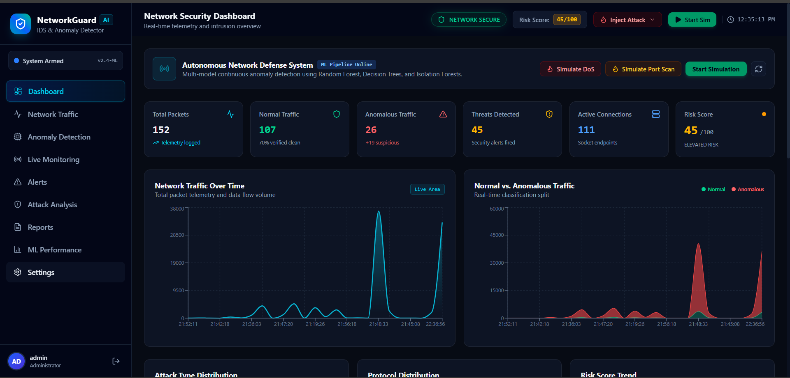
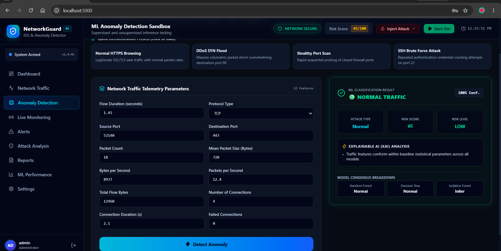
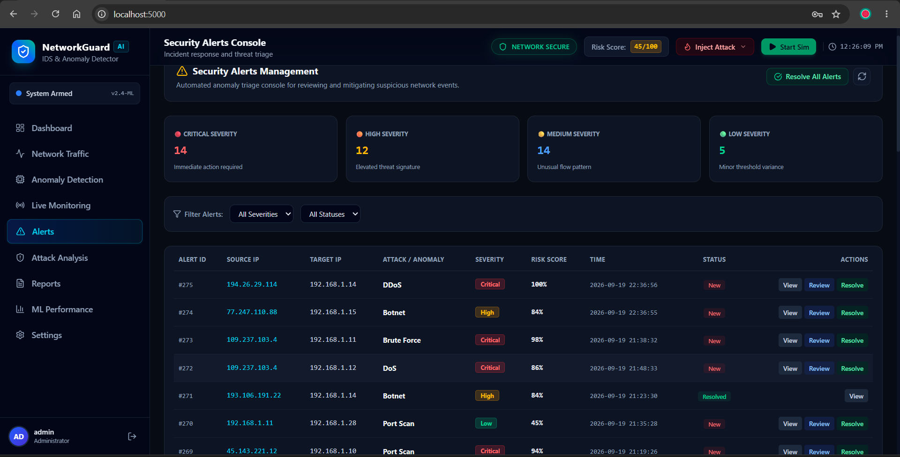
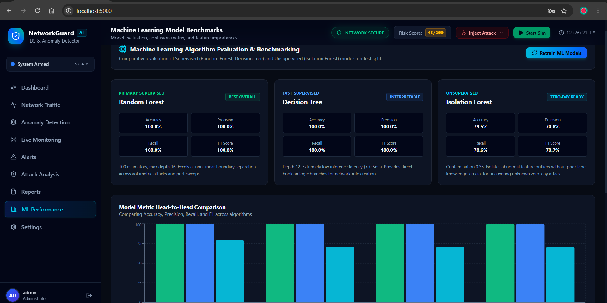

# 🛡️ NetworkGuard AI — Intelligent IDS & Anomaly Detector

**NetworkGuard AI** is a real-time, multi-model Network Intrusion Detection System (IDS) and Anomaly Monitoring Platform. The system leverages live telemetry data and machine learning algorithms to continuously analyze network traffic, identify potential cyber threats, and mitigate security incidents[cite: 2, 4].

---

## 📸 Key Application Dashboards

### 1. Live Security Dashboard
*Real-time packet telemetry, risk score tracking, and intrusion overview[cite: 2].*



---

### 2. ML Anomaly Detection Sandbox
*Telemetry parameter testing, live attack presets, and model consensus breakdown[cite: 3].*



---

### 3. Security Alerts Console
*Incident response console with severity classification and threat triage actions[cite: 4].*



---

### 4. ML Model Performance Benchmarks
*Algorithm comparison benchmarks, confusion matrix, and feature importances[cite: 7].*



---

## ✨ Core Features

- **Multi-Model Consensus Engine:**
  - **Random Forest & Decision Tree:** Primary supervised classifiers for known attack vectors (DDoS, Brute Force, Port Scan, Botnet, and DoS)[cite: 2, 6].
  - **Isolation Forest:** Multi-dimensional unsupervised anomaly detection to catch zero-day attacks and abnormal traffic spikes[cite: 2, 6].
- **Interactive Anomaly Sandbox:** Test scenarios with pre-configured attack presets (Normal HTTPS, DDoS SYN Flood, Stealthy Port Scan, SSH Brute Force)[cite: 3].
- **Real-Time Traffic Simulator:** Injects synthetic network traffic and monitors telemetry flow dynamically[cite: 2, 8].
- **Explainable AI (XAI) & Incident Console:** Real-time threat classification, automated risk scoring, and triage console[cite: 3, 4].
- **Security Reporting & Audit:** Detailed incident summaries and verifiable ML pipeline performance benchmarks[cite: 6].

---

## 🏗️ Project Structure

```text
NetworkGuard-AI/
├── backend/
│   ├── app.py                   # Flask API entrypoint & telemetry server
│   ├── database.py              # SQLite storage for packet logs and alert history
│   ├── simulator.py             # Network traffic simulator and attack injector[cite: 1]
│   ├── ml/
│   │   ├── dataset_generator.py # Synthetic network traffic data generation pipeline[cite: 1]
│   │   ├── train_models.py      # ML model training and evaluation routines[cite: 1]
│   │   └── predictor.py         # Multi-model real-time inference logic[cite: 1]
│   └── models/                  # Serialized trained model artifacts (.pkl)[cite: 1]
├── frontend/
│   ├── src/                     # React dashboard components, graphs, and UI views[cite: 1]
│   ├── dist/                    # Production build assets[cite: 1]
│   └── vite.config.js           # Vite development server configuration[cite: 1]
├── alerts.png.png
├── anomaly-detection.png
├── dashboard.png
└── ml-performance.png

🚀 Getting Started
1. Backend Setup (Flask API)

# Navigate to the backend directory
cd backend

# Create and activate a virtual environment
python -m venv venv

# On Windows:
venv\Scripts\activate
# On Linux/macOS:
source venv/bin/activate

# Install required dependencies
pip install -r requirements.txt

# Start the Flask backend server
python app.py


The backend API server will run on http://127.0.0.1:5000[cite: 2].
2. Frontend Setup (React UI)Bash# Open a new terminal and navigate to the frontend directory
cd frontend

# Install node dependencies
npm install

# Run the development server
npm run dev
The application dashboard will be live at http://localhost:5173.

🛠️ Tech Stack
Frontend:React, Vite, Tailwind CSS, Lucide Icons

Backend: Python, Flask, SQLite[cite: 1]

Machine Learning: Scikit-Learn (Random Forest, Decision Tree, Isolation Forest), Pandas, NumPy   Telemetry & Simulation: Multi-threaded packet flow simulator[cite: 1]

👥 Project Contributors
Hinal Machhi (@hinalmachhi)
Vedika Manjarekar
Saini Pagdhare
